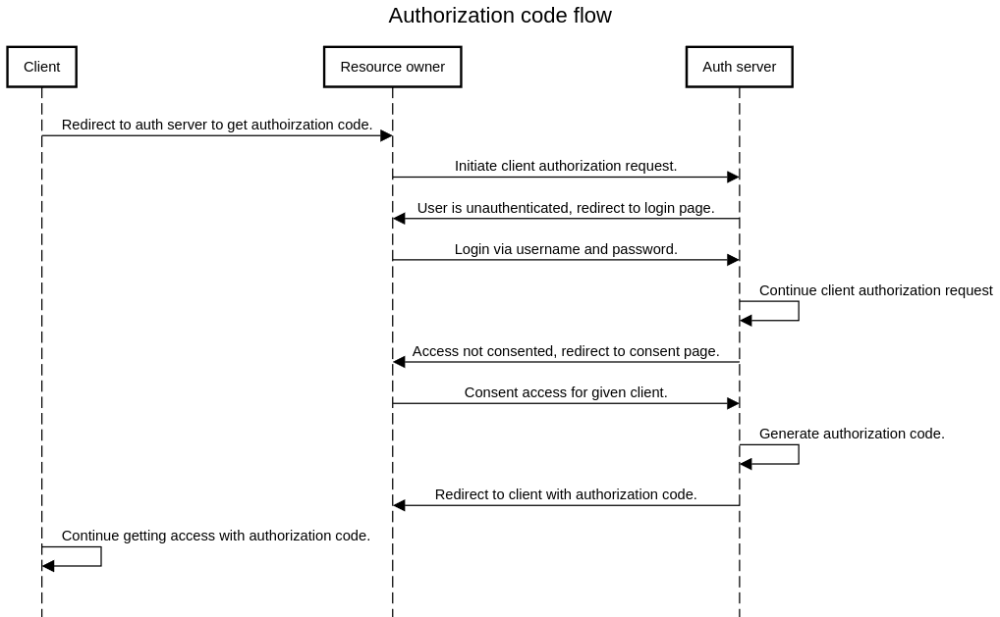

# SPA in Spring Auth Server - POC

The goal of this repo is to show possibility to have web pages in authorization server (login page, consent access page) configured as SPA pages. The only limitation is unconfigurable RedirectStrategy in OAuth2AuthorizationEndpointFilter.

A resource owner (end user) can directly interact via its web browser with authorization server to perform the following activities:
- login - to authenticate the user.
- consent access - to let user decide what access they want to grant to given client.

These pages are shown to the user in authorization code flow.



By default, they are automatically generated by frameworks. However, what if we wanted to have those pages in SPA app? We can accomplish that by doing the following:
- develop simple SPA separately and eventually embed it into the server
- make login and consent requests restful friendly on the server, so that web pages can utilize the requests. Currently, the outcome of those requests is always redirection via HTTP 302 Found response and Location header, which is **automatically handled by the browser and our SPA does not have any control over these requests**. It's ok when web pages are meant to be controlled entirely by the server, but not if we want to control the response on client side.

First step is achievable, but the second one is really not (unless we go with Reflection API which is not something easily maintainable later).
To make the requests restful friendly, we would need to overwrite RedirectStrategy used there, to work like this: if restful response is preferred, send response with redirectUrl in body - otherwise, send classic redirect (via http 302 and location header).
With this implementation in place, we can have those pages fully working as SPA.

## Try it out.

Repo is composed of two projects:
 - server - customized Spring Authorization Server
 - web - SPA based on React, eventually supposed to be embedded into the server.

So we can say: auth-server = server + web.

Once application has started, login via l:admin p:admin

### Via docker compose

If you have docker compose, open terminal in the project's dir and run:
```
docker compose up --build
```

### Via gradle and npm

If you prefer to not use docker, you can use Gradle and NPM.
```
# server
cd server
./gradlew bootRun

# web
cd web
npm ci
npm start
```

